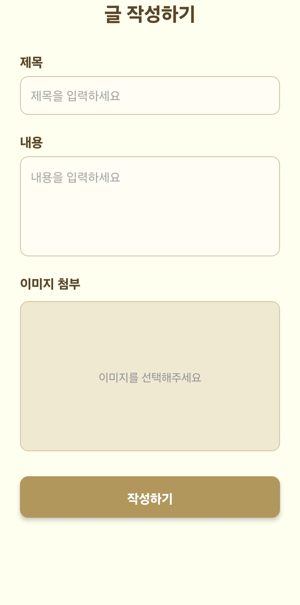

## 📝 Community MVP

> 서비스 MVP - Expo 기반의 커뮤니티 서비스

### 📌 프로젝트 개요

React Native + Firebase를 활용한 카드형 커뮤니티 앱 MVP 프로젝트입니다.

---

### ✅ 주요 기능

| 기능 구분              | 설명                                 |
| ------------------ | ---------------------------------- |
| 🔐 **회원가입 / 로그인**  | 이메일 기반 Firebase Auth 해당            |
| 👤 **마이페이지**       | 내 정보 확인, 당근 변경, 내가 쓰던 글 보기         |
| 📝 **게시물 작성**      | 제목, 내용, 이미지 포탈                     |
| 🖼 **이미지 업로드**     | Expo ImagePicker 통해 가상 검색          |
| 📒 **게시물 목록/상세보기** | FlatList 기반 프리드 게시물                |
| ❤️ **좋아요**         | 실시간 반영, 중복 좋아요 방지                  |
| 💬 **댓글**          | 삽입 / 복잡 가능, 실시간 반영                 |
| 🔍 **이미지 확대**      | 게시물 이미지 클릭 시 Modal  Modal \uud655대 |

---

### ⚙️ 기술 스택

| 범위          | 기술                                |
| ----------- | --------------------------------- |
| **프로파일**    | React Native (Expo), TypeScript   |
| **백업 / DB** | Firebase Firestore, Firebase Auth |
| **이미지 처리**  | Expo ImagePicker                  |
| **빌드 / 배포** | EAS CLI, Expo Build               |
| **상태 관리**   | useState, useEffect 기반 로컬 상태 관리   |

---

### 💡 특징

* Firebase 실시간 연동으로 **좋아요/댓글 수 실시간 반영**
* **이미지 업로드 + 확대 보기 기능** 포함한 콘텐츠 기반 SNS 구성
* 감성적인 **크림톤 테마** 색상 사용
* React Native 구조를 초보자도 이해하기 쉬운 **컴포넌트 분리 + 폴더 구조화**

---

* 📸 스크린샷 이미지

<p align="center"> 
   
   
</p>

<p align="center">
  <i>로그인 화면 / 회원가입 화면</i>
</p>

<br/>

<p align="center"> 
   
   
</p>

<p align="center">
  <i>홈 화면 / 게시글 상세</i>
</p>

<br/>

<p align="center"> 
   
   
</p>

<p align="center">
  <i>마이페이지 화면 / 회원정보수정 & 내가 쓴 글 확인</i>
</p>

<br/>

<p align="center"> 
   
</p>

<p align="center">
  <i>글 작성 화면</i>
</p>


### 🛠️ 실행 방법

```bash
# Expo 설치
npm install -g expo-cli

# 의존성 설치
npm install

# 실행
npm start
```

> Android/iOS 기기에서 Expo Go 어플 다운로드 후 QR 실행 혹은 `eas build -p android` 로 APK 빌드 가능

---

### 🔐 Firebase 설정

Firebase 콘솔에서 발급받은 config를 `/services/firebase.ts`에 다음과 같이 입력하세요:

```ts
const firebaseConfig = {
  apiKey: "...",
  authDomain: "...",
  ...
};
```

---

> 본 프로젝트는 커뮤니티 게시판 MVP로 개발되었으며, 핵심 기능 구현을 중점으로 구성되었습니다.
